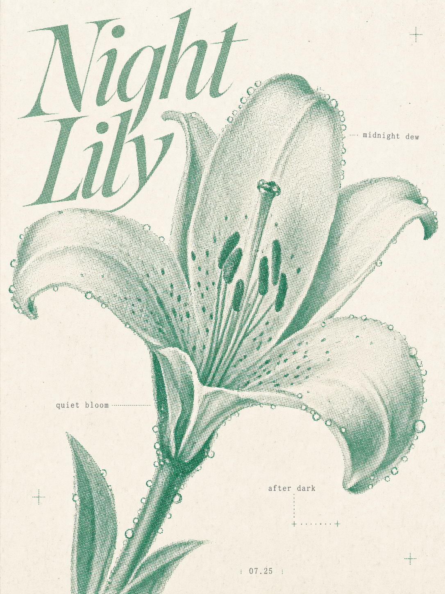
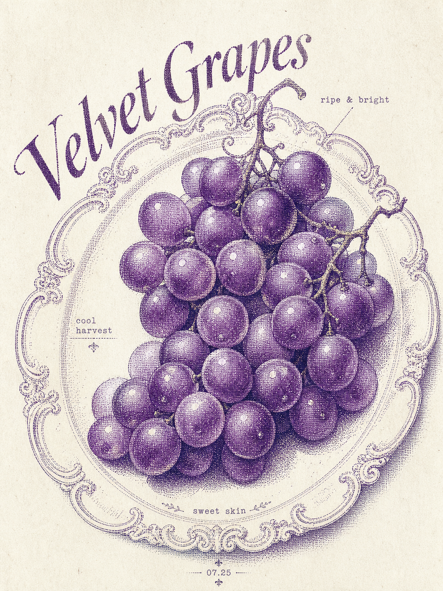
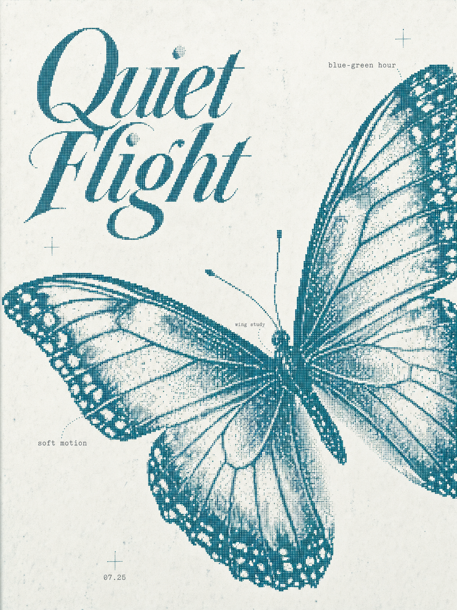

# Pixel Style Poster Skill

A Codex skill for generating 3:4 editorial bitmap poster prompts and matching raster images.

The skill creates posters with:

- large fine dot-matrix subjects
- optional title-led or quiet microtype layouts
- close subject-text typography
- small surrounding captions and labels
- soft colored-wash reverse-halftone variants
- restrained color systems
- low-resolution print texture

This is not retro game pixel art. The style is closer to fine bitmap editorial posters, halftone print studies, botanical bitmap posters, and poetic type-led image layouts.

## Examples

| Mint Night Lily | Rococo Velvet Grapes | Deep Teal Butterfly |
| --- | --- | --- |
|  |  |  |

## Install

Clone this repository into your Codex skills directory:

```bash
git clone https://github.com/v92388375-gif/pixel-style-poster-skill.git ~/.codex/skills/pixel-style-poster-skill
```

Restart Codex if the skill does not appear immediately.

## Usage

Invoke the skill by name and provide a subject, phrase, mood, or brief:

```text
用 $pixel-style-poster-skill 做一张薄荷绿主题的百合花海报，小字和夜晚、宁静、露水有关
```

## Output

For generation requests, the skill returns:

1. the generated poster image
2. the final image-generation prompt
3. the selected recipe and short interpretation note
